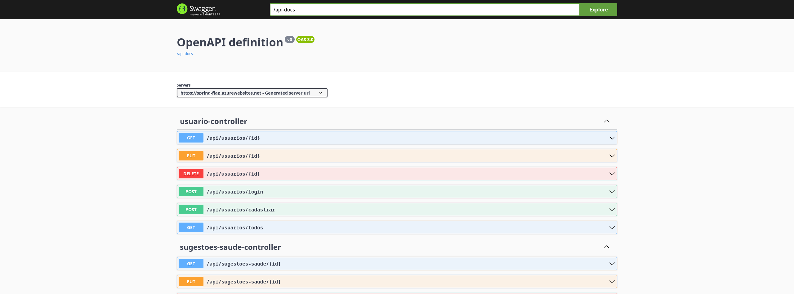

# HealthHub

## Introdução

* Bem-vindo ao HealthHub, seu parceiro dedicado para uma vida saudável e consciente!
* Revolucionamos a gestão da saúde com uma plataforma intuitiva e personalizada.

## Principais Características

1. **Registro Simples:**
   Sua jornada para o bem-estar começa com o fácil registro de informações essenciais.
2. **Personalização:**
   Dados cruciais, como peso, altura, hábitos de saúde, alimentação e sono, são usados para personalizar sua experiência.
3. **Sugestões Personalizadas:**
   Oferecemos sugestões do calendário de saúde governamental, alinhadas com suas características individuais.
4. **Esclarecimento de Dúvidas:**
   No futuro, queremos colocar uma aba exclusiva que irá permitir esclarecer dúvidas com o GPT, incluindo recomendações médicas personalizadas.
5. **Atualizações Mensais:**
   Posteriormente queremos implementar as atualizações mensais do Ministério da Saúde, abordando conscientização e prevenção de doenças.

## Objetivo do App

* Simplificar a gestão da saúde, proporcionando orientações personalizadas e informações relevantes.
* Compromisso em promover um estilo de vida saudável e consciente.
* Viva melhor, sinta-se melhor, seja melhor. Bem-vindo ao HealthHub, onde sua saúde está no centro de tudo que fazemos.


**Testar a aplicação em nuvem (Swagger)**

[Link do Swagger da aplicação](https://spring-fiap.azurewebsites.net/swagger-ui/index.html)




- Um exemplo de json utilizado nos testes
  
```
Cadastrar Usuário "baseURL"/api/usuarios/cadastrar
{
  "nome": "Alberto",
  "email": "alberto@gmail.com",
  "senha": "s0LY037PUwn2",
  "role": "USER"
}

Login Usuário "baseURL" /api/usuarios/login
{
  "email": "alberto@gmail.com",
  "senha": "s0LY037PUwn2",
}

Atualizar Usuário "baseURL"/api/usuarios/1
{
  "id": 1,
  "nome": "Alberto",
  "email": "alberto@gmail.com",
}


Login Usuário "baseURL"/api/usuarios/login
{
  "nome": "Alberto",
  "email": "alberto@gmail.com",
  "senha": "s0LY037PUwn2"
}


Cadastar Atualização Saúde "baseURL"/api/atualizacoes-saude-pub

{
  "titulo": "Janeiro Branco - sinal de alerta para a saúde mental ",
  "descricao": "Janeiro é o mês dedicado à conscientização a respeito da saúde mental, cada vez mais reconhecida como uma prioridade global de saúde e desenvolvimento econômico.",
  "dtInfoSaude": "2024-01-01"
}

Update Atualização Saúde "baseURL"/api/atualizacoes-saude-pub/2

{
  "id": 2,
  "titulo": "Outubro Rosa: campanha de saúde sobre o câncer de mama",
  "descricao": "Com a chegada do mês de outubro, tem início mais uma edição da campanha Outubro Rosa, que tem o objetivo de conscientizar à prevenção, diagnóstico precoce do câncer de mama. ",
  "dtInfoSaude": "2024-10-01"
}


Delete Atualização Saúde "baseURL"/api/atualizacoes-saude-pub/2

{
  "id": 2,
  "titulo": "Outubro Rosa: campanha de saúde sobre o câncer de mama",
  "descricao": "Com a chegada do mês de outubro, tem início mais uma edição da campanha Outubro Rosa, que tem o objetivo de conscientizar à prevenção, diagnóstico precoce do câncer de mama. ",
  "dtInfoSaude": "2024-10-01"
}

```
#### Docker

- Vai compilar seu código e também empacotá-lo e criará um jar utilizado no dockerfile.
```
mvn clean package

```
- Atalho Docker Compose, executando um "stop", caso tenha feito um "start" anterior & mostrando nome e porta que esta rodando.
- Extra [Link do video da aplicação Mobile](https://drive.google.com/file/d/1CzgH3VgIX1sij66K4sAc7_AglflAehjG/view)
```
sudo docker-compose down && sudo docker-compose up -d --build && sudo docker-compose ps

```
